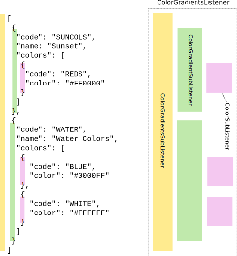

# JSON

[JSON](http://www.json.org/) is a simple textual description of a data structure.  An example of some JSON would be;

```
[ "apple", "orange", { "drink": "tonic water", "count" : 123 } ]
```

## Parsing

### Generic In-Memory Model

For some applications, parsing to an in-memory data structure is ideal.  In such cases, the ```BJson``` class provides static methods for parsing a block of JSON data into a ```BMessage``` object.

#### BMessage Structure

The ```BMessage``` class has the ability to carry a collection of key-value pairs.  In the case of a JSON object type, the key-value pairs correlate to the JSON object.  In the case of a JSON array type, the key-value pairs are the index of the elements in the JSON array represented as strings.

For example, the following JSON array...

```
[ "a", "b", "c" ]
```

...would be represented by the following ```BMessage```;

|Key|Value|
|---|---|
|"0"|"a"|
|"1"|"b"|
|"2"|"c"|

A JSON object that, in its entirety, consists of a non-collection type such as a simple string or a boolean is not able to be represented by a ```BMessage```; at the top level there must be an array or an object.

### Streaming

Streaming is useful in many situations;

* where handling the parsed data is easier to undertake as a stream of events
* where the quantity of input or output data could be non-trivial and holding that quantity of material in memory is undesirable
* where being able to start processing a stream of data before the entire payload has arrived is desirable

This architecture is sometimes known as an event-based parser or a "SAX" parser.

The ```BJson``` class provides a static method that accepts a stream of JSON data in the form of a ```BDataIO``` and a ```BJsonEventListener``` sub-class.  As each token is processed from the stream, it will provided to the listener.  The listener must implement three callback methods to handle the JSON parsing;

|Method|Description|
|---|---|
|Handle(..)|Provides JSON events to the listener|
|HandleError(..)|Signals parse or processing errors to the listener|
|Complete(..)|Informs the listener that parsing has completed|

Events are embodied in instances of the ```BJsonEvent``` class and each of these has a type.  Sample example types are;

* B_JSON_STRING
* B_JSON_OBJECT_START
* B_JSON_TRUE

In this way, the listener is able to interpret the incoming stream of data as JSON and handle it in some way.

The following JSON...

```
{"color": "red", "alpha": 0.6}
```

Would yield the following stream of events;

|Event Type|Event Data|
|---|---|
|B_JSON_OBJECT_START|-|
|B_JSON_OBJECT_NAME|"color"|
|B_JSON_STRING|"red"|
|B_JSON_OBJECT_NAME|"alpha"|
|B_JSON_NUMBER|0.6|
|B_JSON_OBJECT_END|-|

#### Number Handling

The JSON number literal format does not specify a numeric type such as ```int32``` or ```double```.  To cope with the widest range of possibilities, the ```B_JSON_NUMBER``` event type captures the content as a string and then the ```BJsonEvent``` object is able to provide the original string for specific handling as well as convenient accessors for parsing to ```double``` or ```int64``` types.  This provides a high level of flexibility for the client.

#### Stacked Listeners

One implementation approach for the listener used to read a data-transfer-object (DTO) is to create "sub-listeners" that mirror the structure of the JSON.

In the following example, a nested data structure is being parsed.



A primary-listener is employed called ```ColorGradientsListener```.  The primary-listener accepts JSON parse events and will relay them to a sub-listener.  The sub-listener is implemented to specifically deal with one tier of the inbound data.  The sub-listeners are structured in a stack where the sub-listener at the head of the stack has a pointer to it's parent.  The primary-listener maintains a pointer to the current head of the stack and will direct events to that sub-listener.

In response to events, the sub-listener can take-up the data, pop itself from the stack or push additional sub-listeners from the stack. 

The same approach has been used in the following classes in a more generic manner;

* BJsonTextWriter
* BJsonMessageWriter

The intention with this approach is that the structure of the event handling code in the sub-listeners mirrors that of the data-structure being parsed.  Hopefully this makes creating the filling of a specific data-model easier even when very specific behaviours are required.
 
 From a schema of the data structure it is _probably_ also possible to create these sub-listeners and in this way automatically generate the C++ parse code as event listeners.
 
## Writing

In order to render a data-structure as JSON data, the opposite occurs; events are emitted by the client software into a class ```BJsonTextWriter```.  This class supports public methods such as ```WriteFalse()```, ```WriteObjectStart()``` and ```WriteString(...)``` that control the outbound JSON stream.

### End to End

Because ```BJsonTextWriter``` is accepting JSON parse events, it is also a ```JsonEventListener``` and so can be used as a listener with the stream parsing; producing JSON output from JSON input.  The output will however not include inbound whitespace because whitespace is not grammatically significant in JSON.  